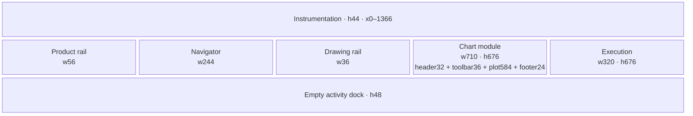
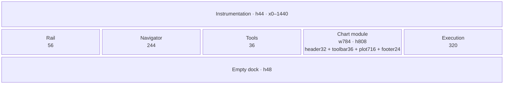
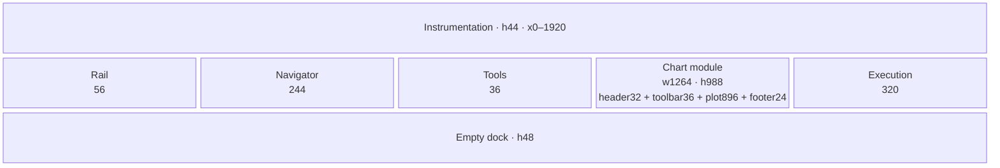
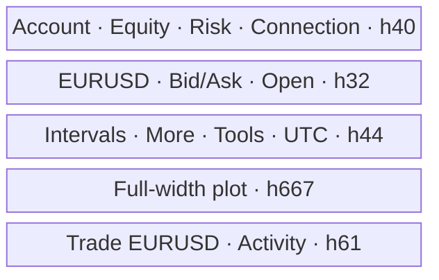
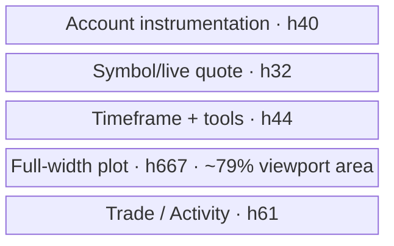
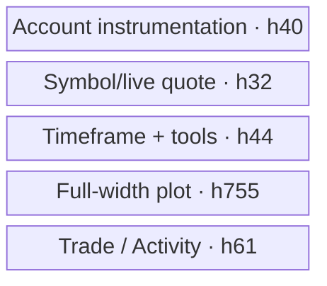

# WARIBA Responsive Architecture 2026

Status: WX0 specification. It extends the canonical UX/Design System breakpoints; it does not create a parallel runtime.

## 1. Ownership rule

Responsive presentation is selected once at the workstation boundary. Desktop and mobile may mount different presentation components, but only one live execution tree, one dock tree and one tool-sheet tree exist at a time. State/controllers remain outside those presentation mounts.

Breakpoints remain token-owned. WariX uses:

- `<1024`: mobile/tablet chart-first composition;
- `1024–1439`: compact desktop workstation;
- `1440–1919`: standard desktop;
- `≥1920`: wide desktop.

## 2. Target track model

### Desktop empty state

| Track | 1024–1439 | 1440–1919 | ≥1920 |
|---|---:|---:|---:|
| product rail | 56 | 56 | 56 |
| Navigator default | 244 | 244 | 244 |
| drawing rail | 36 | 36 | 36 |
| chart | fluid, min 0 | fluid, min 0 | fluid, min 0 |
| execution | 320 | 320 | 320 |
| global instrumentation | 44 high | 44 | 44 |
| empty dock | 48 high | 48 | 48 |
| populated dock default | 200 | 220 | 260 max default only if user preference says so |

Navigator range is 220–320 px. Execution range is 304–360 px. User resizing remains account-scoped. A human resize overrides the default; WX1 does not constantly auto-optimize tracks.

### Mobile

| Layer | Target |
|---|---:|
| safe-area-aware account bar | 40 px minimum |
| symbol/quote/market row | 32 px |
| interval/tools row | 44 px |
| total before plot | ≤116 px |
| plot | full width, fluid height |
| bottom actions | 61 px + safe-area inset |

## 3. Concrete target wireframes

These diagrams specify tracks and order. Values are CSS pixels.

### Desktop 1366×768

Target `chartViewportAreaShare`: approximately `710 × 584 / (1366 × 768) = 39.5%`.

### Desktop 1440×900

### Desktop 1920×1080

At wide sizes, extra width belongs to the chart. Navigator/execution do not expand merely because space exists.

### Mobile 320×844

### Mobile 390×844

### Mobile 430×932

Sheets overlay the plot; they do not insert rows. Market, Tools, Execution and Activity are mutually exclusive top-layer surfaces. Execution and Activity reuse state/controllers but mount one presentation tree only.

## 4. Current evidence and target gains

| Viewport | Current plot box | Current `chartViewportAreaShare` | Target plot box | Target `chartViewportAreaShare` |
|---|---:|---:|---:|---:|
| 1366×768 | 678×410 | 26.50% | ~710×584 | ~39.5% |
| 1440×900 | 740×542 | 30.95% | ~784×716 | ~43.3% |
| 1920×1080 | 1208×722 | 42.06% | ~1264×896 | ~54.6% |
| 320×844 | 304×601 | 67.65% | 320×667 | 79.0% |
| 390×844 | 374×601 | 68.29% | 390×667 | 79.0% |
| 430×932 | 414×689 | 71.18% | 430×755 | 81.0% |

Target figures are architecture budgets, not claims about implemented pixels.

WX1 must additionally report `chartShareOfCenterWorkspace = chartPlotArea / centerWorkspaceArea`. On desktop, the center workspace is the principal content rectangle below global instrumentation and above the activity dock, excluding global product navigation while including Navigator, drawing rail, chart and Execution Center. On mobile, it is the full-width rectangle below the global account bar and above the bottom action rail, including market/tools chrome and plot. Overlaying sheets are excluded. The same chart-plot rectangle is the numerator for both KPIs.

`chartShareOfCenterWorkspace` has no fabricated WX0 target: `TO_BE_PROVEN_BY_WX1_EVIDENCE`. Baseline and candidate must be captured at the same viewport, dock state and measurement boundary. This normalized KPI prevents the apparent dominance gain from being credited solely to a smaller dock.

## 5. Responsive audit matrix

`M` = runtime measured in WX0; `C` = code path/contract inspected; `WX1` = required final evidence.

| Viewport | Mode | WX0 evidence | Target visible primary controls | Target geometry risk |
|---|---|---|---|---|
| 320×844 | mobile | M | account, symbol/quote, intervals, Tools, Trade, Activity | longest French labels; sheets; 44 px targets |
| 360×800 | mobile | M | same | shortest target height; execution scroll |
| 375×812 | mobile | C / WX1 | same | safe-area and iPhone-sized width |
| 390×844 | mobile | M | same | canonical mobile review |
| 412×915 | mobile | C / WX1 | same | sheet width and structured rows |
| 430×932 | mobile | M | same | wide phone must not become desktop-like |
| 768×1024 | mobile/tablet | C / WX1 | chart-first + sheets | excessive blank width; sheet max width |
| 1024×768 | compact desktop | C / WX1 | rail, Navigator, drawing rail, chart, execution, dock | chart min-width; toolbar overflow |
| 1366×768 | compact desktop | M | every module | governing height constraint |
| 1440×900 | desktop | M | every module | canonical design review |
| 1536×864 | desktop | C / WX1 | every module | short height with wider chart |
| 1920×1080 | wide | M | full instrumentation | uncontrolled side expansion |
| 2560×1440 | wide | M | full instrumentation | chart legibility/live-edge density |

Every WX1 row must record document/client width, overflow, global bar, pre-plot chrome, tracks, plot, dock, visible controls, minimum target, clipping, toolbar overflow and sheet rectangle.

## 6. Toolbar transformation

Registration/exposure of the ten target intervals and their professional historical depth are WX2 data work. W5 already has one generic, duration-driven candle aggregator; WX2 extends the canonical interval list and duration map, then adds the durable history capability. The responsive control contract is nevertheless locked:

- desktop 1366: up to five frequent intervals + `More`;
- desktop ≥1920: all honest enabled intervals may be visible if the toolbar still fits;
- mobile: five frequent intervals + `More`, 44 px practical targets;
- the selected interval is always visible in the trigger even when sourced from More;
- `1m` and `1M` retain exact case;
- no horizontal document scrolling; toolbar groups may use an owned overflow menu, not a clipped strip.

WX1 recomposes only currently implemented intervals and must not expose unavailable target intervals.

## 7. Dock transformation

Empty state is content-aware but stable:

- zero active rows: 48 px;
- first active row: one deliberate expansion to at least 112 px;
- populated: preference default/current explicit user height;
- clearing the final row does not instantly collapse during a command; collapse occurs after authoritative snapshot settles and a 300 ms stability window, with reduced motion instant;
- manual user height is never overwritten while populated.

## 8. Text and overflow rules

- Financial values do not ellipsize without an accessible full value.
- Symbol names remain complete for the five shipped symbols.
- Status bar progressively hides secondary metric pairs by breakpoint; full values remain in Risk detail.
- Tables own horizontal overflow only on desktop; mobile uses structured rows.
- The document never scrolls horizontally.
- Bottom sheets are safe-area aware and own their internal vertical scrolling.

## 9. Multi-chart future seam

Future layouts may be `1`, `2 horizontal`, `2 vertical`, `4 grid`. A future layout owner creates chart-module instances keyed by `chartInstanceId`. Each instance owns symbol, interval, renderer and local analysis preferences. The global bar owns account/workspace only. WX1 builds a composable module boundary but instantiates exactly one chart.
