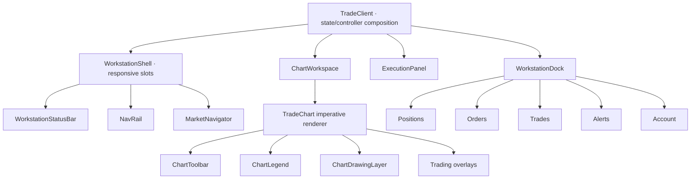

# WARIBA Workstation Component Map

Status: WX0 implementation decision matrix.

## 1. Ownership map

Trading overlays remain above drawings; drawing interaction remains above chart pan/zoom. Presentation recomposition does not move command authority into this tree.

## 2. Decision matrix

| Component | Decision | Current problem | WX1 target | Risk | Milestone |
|---|---|---|---|---|---|
| `TradeClient` | KEEP | large composition but correct state seams/single trees | props/adapters only for new presentation wrappers | lifting kinetic state here would rerender globally | B0 contract freeze |
| `WorkstationShell` (`WorkstationFrame`) | RECOMPOSE | fixed default tracks leave small 1366 plot; no drawing-rail slot | 56/244/36/fluid/320 tracks; 44 top; intelligent dock | CSS grid regression/min-content overflow | B2 desktop frame |
| `WorkstationStatusBar` | RECOMPOSE | valuable text reads as a sentence | `MetricReadout` instrumentation with breakpoint hierarchy | hiding authoritative risk | B2 global bar |
| `NavRail` (`WorkstationNavRail`) | REFINE | handcrafted icon inconsistency; brand block dominates | coherent icons, tooltips, active Cobalt edge, 40 px targets | route/dead-control regression | B2 nav |
| `MarketNavigator` | REFINE | 280 px default, loose vertical rhythm | 244 px, 36 px rows, stronger selection, same real data | clipping max precision/French status | B3 navigator |
| `ChartWorkspace` | KEEP | no material architecture defect | remains business/view boundary | accidental tick subscription | B0/B4 |
| `TradeChart` | KEEP BEHAVIOR / RECOMPOSE CHROME | plot is sound; context/toolbar/legend form stacked rows | module header + toolbar + rail + footer around same renderer | overlay geometry/z-index | B4 chart module |
| `ChartToolbar` | REPLACE PRESENTATION ONLY | text-heavy; drawings hidden behind `Outils` | grouped workbench toolbar; only real actions | dead target intervals/actions | B4 toolbar |
| `ChartLegend` | REFINE | indicator line can crowd mobile plot | compact/collapsible OHLC + indicator values; collision limits | hiding values/warm-up truth | B4 legend |
| `ChartDrawingLayer` | KEEP | architecture/visibility accepted | same model/SVG/priority; new surrounding tools only | pointer capture or stacking regression | B0 regression gate |
| drawing context actions | REPLACE PRESENTATION ONLY | text bar is visually primitive/obstructive | compact `ContextToolbar`, style/delete/done | destructive tap proximity | B5 drawings |
| desktop drawing tools | RECOMPOSE | six tools behind popover | dedicated 36 px rail | becomes second product nav; icon ambiguity | B5 drawings |
| `ExecutionPanel` | RECOMPOSE | semantic sections visually read as a web form | quote deck, compact segment/quantity/protection, impact strip, fixed actions | warnings lost for density | B6 execution |
| execution subcomponents | REFINE | correct but spacing/labels independently styled | owned module density primitives | behavior drift | B6 |
| `WorkstationDock` (`Dock`) | RECOMPOSE | empty 220 px consumes plot; desktop table on mobile | 48 empty / stable populated; mobile structured rows | jitter/unauthorized auto state | B7 activity |
| Positions content | REFINE | empty table header still occupies space | compact empty; same live PnL rows when populated | `useAllTicks` ownership | B7 |
| Orders content | REFINE | table density/mobile fit | compact desktop rows/mobile structured rows | cancel authority/action names | B7 |
| Trades content | REFINE | nine-column mobile pressure | structured fill/eligibility rows | confusing order vs fill truth | B7 |
| Alerts content | REFINE | operational states visually flat | status chip + structured rows | enabled/deleted state ambiguity | B7 |
| Account content | REFINE | secondary navigation in dock | compact metrics and canonical payout route | reintroducing payout in dock | B7 |
| `BottomSheet` | REFINE | correct semantics, limited presence/gesture polish | Kinetic surface/safe area; optional Base UI pilot | focus/virtual keyboard/duplicate trees | B1/B8 |
| risk dialog/sheet | REFINE | dense details not cockpit-linked | Risk entry from bar; structured meters/details | local risk calculation | B2/B8 |
| alerts/notifications dialogs | REFINE | generic alert styling | status hierarchy and stable server code | over-announcing tick changes | B8 |
| `ChartContextMenu` | KEEP + REFINE VISUALS | behavior already price-aware | workbench menu style, same exact actions | accidental trade action or focus regression | B5 |
| `ModifyPositionDialog` / pending dialogs | KEEP + REFINE | functional | token/density alignment only | command semantics | B8 |
| multi-chart layout | DEFER | absent by decision | define `chartInstanceId` boundary only | subscription explosion | future WX3+ |
| seconds-first interval UX | DEFER REPLACEMENT TO WX2 | current truthful process-memory default | target family after provider history | fake/sparse history | WX2 |
| DOM/tape/volume UI | DELETE/REJECT | not present/unsupported | none | false market claim | permanent non-scope V1 |

## 3. Render ownership budget

| Event | Allowed React owners | Must remain zero |
|---|---|---|
| 25 selected-symbol ticks | Chart, Execution quote/impact, visible live Positions | shell, status chrome, nav, toolbar, drawing rail, Navigator chrome, dock chrome, closed transients |
| 25 unselected-symbol ticks | visible matching Navigator row only | chart, execution, global chrome |
| drawing drag | chart-local imperative overlay/context only | global/shell/execution/dock |
| indicator toggle | chart analysis/legend/renderer | global/shell/execution/dock |
| pan/zoom | Lightweight Charts + history controller when threshold crossed | global React tree |
| five execution draft edits | execution tree only | chart, shell, Navigator, dock |
| dock tab/activity | active dock tree only | chart/execution/global chrome |

## 4. Dependency boundaries

- UI consumes DTO/view props, never repositories or database packages.
- Kinetic primitives contain no policy/risk/order arithmetic.
- `TradeChart` remains renderer boundary; new module chrome does not import Lightweight Charts.
- history remains behind `ChartHistoryTransport` and `MarketHistoryPort`.
- mobile presentation shares controllers, not hidden DOM.
