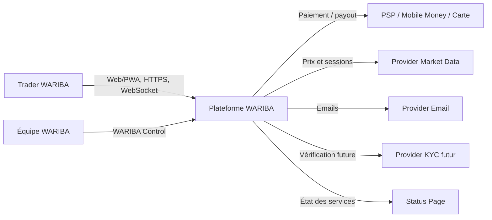
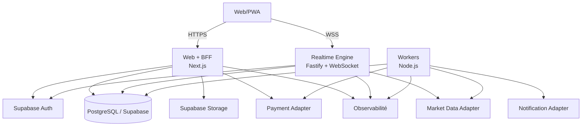
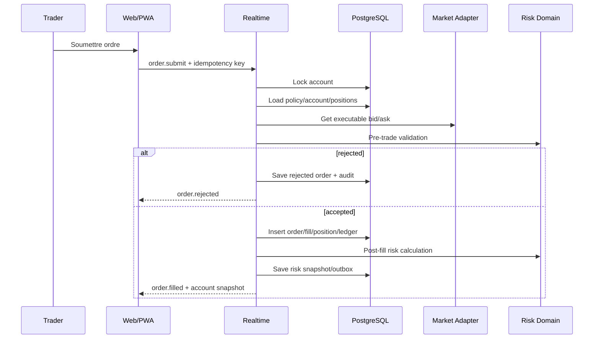
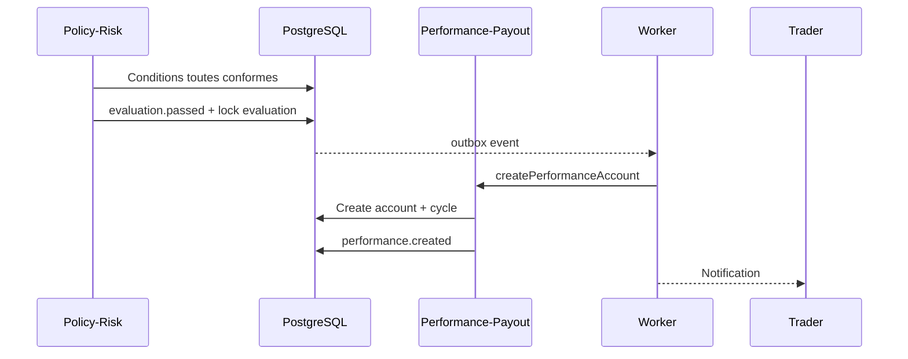
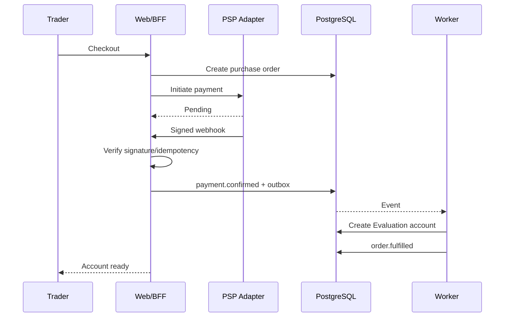
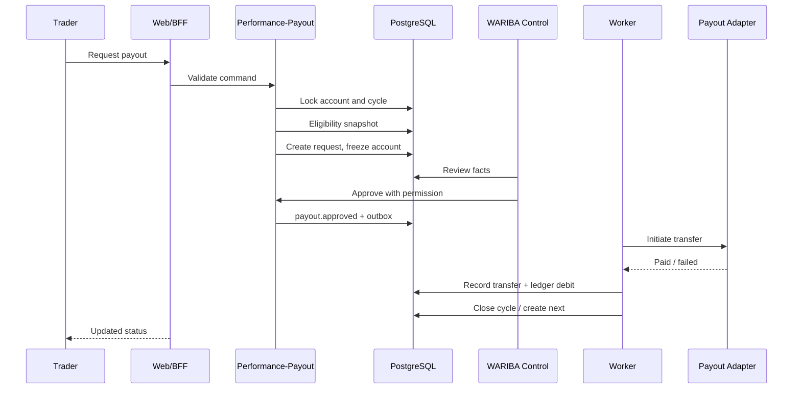
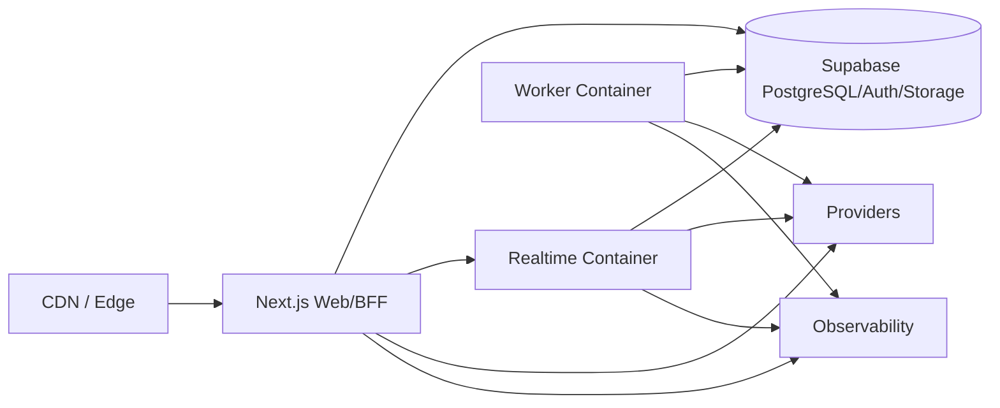
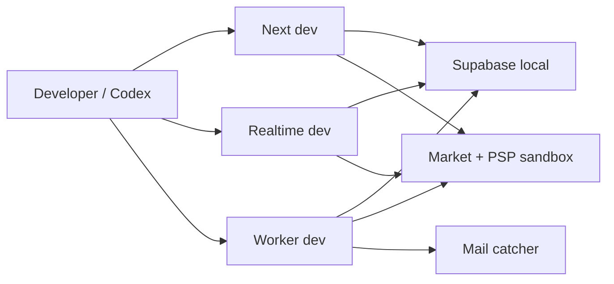

# WARIBA System Architecture v1.0

> **Simple à déployer. Difficile à corrompre. Facile à auditer.**

## Contrôle du document

| Champ | Valeur |
|---|---|
| Marque | WARIBA |
| Domaine principal | `wariba.app` |
| Dépôt | GitHub privé `wariba-platform` |
| État réel | Dossier créé, aucun code commencé |
| Agent de construction | Codex |
| Architecture | Modular monolith + services runtime limités |
| Frontend/BFF | Next.js + React + TypeScript strict |
| Service temps réel | Node.js + Fastify + WebSocket |
| Workers | Node.js, même domaine applicatif |
| Base | PostgreSQL managé par Supabase |
| Auth | Supabase Auth |
| Storage | Supabase Storage privé |
| Requêtes SQL | Kysely typé + SQL explicite |
| Migrations | Supabase CLI, SQL versionné |
| Validation | Zod |
| Précision | Decimal.js + PostgreSQL `numeric` |
| Charting | Lightweight Charts |
| Événements | Transactional outbox, sans Kafka |
| Cache | Aucun cache distribué obligatoire en V1 |
| PWA | Oui |
| Application native | Non en V1 |
| Broker / capital réel | Non en V1 |
| Capital de trading | Simulé |
| Déploiement production | Approbation manuelle |

---

# 1. Objet de l’architecture

Cette architecture transforme les documents produit, règles, UX et ingénierie en un système réalisable.

Elle définit :

1. les frontières du système ;
2. les applications et services ;
3. les modules métier ;
4. les flux de données ;
5. les modèles de cohérence ;
6. la stratégie de persistance ;
7. les contrats HTTP et WebSocket ;
8. la sécurité ;
9. les flux paiement, trading, risque et payout ;
10. l’exécution sandbox ;
11. les environnements ;
12. la topologie de déploiement ;
13. les décisions de coût et de simplicité ;
14. les points de montée en charge ;
15. les pannes et modes dégradés ;
16. les décisions ouvertes avant production.

Ce document n’autorise pas encore le lancement public. Il rend possible l’initialisation propre du dépôt puis la construction de la bêta privée.

---

# 2. Contraintes fondatrices

## 2.1 Contraintes produit

- français d’abord ;
- Afrique francophone ;
- mobile-first ;
- web/PWA ;
- compte simulé ;
- WARIBA ONE unique ;
- WARIBA Performance ;
- cinq payouts maximum avant WARIBA Review ;
- aucune promesse de Live automatique ;
- aucun conseil de trading ;
- aucune règle cachée.

## 2.2 Contraintes financières

- précision décimale ;
- non-rétroactivité ;
- payout plafonné ;
- réserve séparée ;
- aucun double payout ;
- aucune balance éditable manuellement ;
- audit complet.

## 2.3 Contraintes opérationnelles

- petite équipe ;
- Codex principal ;
- budget initial contraint ;
- services managés lorsque raisonnable ;
- faible charge de maintenance ;
- déploiement réversible ;
- procédures compréhensibles.

## 2.4 Contraintes techniques

- modular monolith ;
- TypeScript strict ;
- PostgreSQL ;
- RLS ;
- serveur autoritaire ;
- WebSocket ;
- idempotence ;
- transactional outbox ;
- tests déterministes ;
- CI obligatoire.

---

# 3. Décision d’architecture principale

WARIBA adopte :

> **Un modular monolith déployé en trois processus : Web/BFF, Realtime et Worker, partageant le même domaine, la même base PostgreSQL et les mêmes packages.**

Les trois processus ne sont pas trois microservices métier.

Ils existent parce que leurs contraintes runtime diffèrent :

- Web/BFF : HTTP, rendu, auth, pages ;
- Realtime : connexions persistantes, ticks, ordres, risque temps réel ;
- Worker : tâches asynchrones, outbox, notifications, finalisations.

Les règles métier restent dans des packages de domaine communs.

---

# 4. Non-objectifs architecturaux V1

WARIBA ne construit pas maintenant :

- microservices métier ;
- Kafka ;
- service mesh ;
- Kubernetes ;
- event sourcing complet ;
- multi-région actif-actif ;
- moteur de matching d’exchange ;
- broker ;
- app native ;
- Redis obligatoire ;
- data lake ;
- machine learning antifraude ;
- moteur IA de trading ;
- copy trading ;
- API publique ;
- stockage de tous les ticks indéfiniment ;
- workflow BPM complexe ;
- infrastructure maison de paiement.

---

# 5. Vue C4 — contexte



En sandbox :

- PSP est remplacé par un adapter déterministe ;
- Market Data est remplacé par un générateur seedé ;
- KYC est remplacé par un workflow test ;
- aucune transaction réelle n’est effectuée.

---

# 6. Vue C4 — conteneurs



---

# 7. Responsabilités des processus

# 7.1 Web/BFF

Responsable de :

- site public ;
- auth UX ;
- Hub ;
- Mission ;
- Performance ;
- Payout Center ;
- support ;
- profil ;
- WARIBA Control ;
- API HTTP ;
- webhooks paiement ;
- rendus initiaux ;
- téléchargement sécurisé ;
- administration des policies selon permissions.

Ne doit pas :

- traiter chaque tick ;
- être source des fills ;
- calculer seul le risque temps réel ;
- maintenir des connexions WebSocket longues si runtime incompatible.

---

# 7.2 Realtime Engine

Responsable de :

- connexions WebSocket ;
- subscriptions ;
- market ticks ;
- état marché ;
- commandes d’ordre ;
- validation pré-exécution ;
- exécution simulée ;
- positions ;
- PnL temps réel ;
- risk evaluation temps réel ;
- soft lock ;
- hard breach ;
- diffusion des snapshots ;
- reprise après reconnexion.

Ne doit pas :

- approuver un payout ;
- confirmer un paiement ;
- gérer le marketing ;
- décider une fraude.

---

# 7.3 Worker

Responsable de :

- publication outbox ;
- notifications ;
- finalisation journalière ;
- snapshots 00:00 UTC ;
- journées qualifiées ;
- inactivité ;
- éligibilité asynchrone ;
- transfert payout sandbox/réel futur ;
- réconciliation ;
- retries ;
- dead-letter ;
- rapports ;
- nettoyage non destructif ;
- projection de réserve.

Ne doit pas :

- contourner les services domaine ;
- éditer les balances directement ;
- inventer des transitions.

---

# 8. Monorepo

```text
wariba-platform/
├── apps/
│   └── web/
│       ├── app/
│       │   ├── (public)/
│       │   ├── (auth)/
│       │   ├── (platform)/
│       │   ├── (trade)/
│       │   └── (control)/
│       ├── middleware.ts
│       ├── public/
│       └── tests/
├── services/
│   ├── realtime/
│   └── worker/
├── packages/
│   ├── design-tokens/
│   ├── ui/
│   ├── contracts/
│   ├── domain/
│   ├── policies/
│   ├── database/
│   ├── validation/
│   ├── observability/
│   ├── adapters/
│   ├── config/
│   └── test-utils/
├── supabase/
│   ├── migrations/
│   ├── seed.sql
│   ├── tests/
│   └── config.toml
├── docs/
├── scripts/
├── tooling/
├── .github/
├── AGENTS.md
├── package.json
├── pnpm-workspace.yaml
├── turbo.json
└── tsconfig.base.json
```

---

# 9. Décision monorepo

## 9.1 pnpm workspaces

`LOCKED`.

## 9.2 Turborepo

`LOCKED` pour :

- orchestration ;
- cache local/CI ;
- graph de tâches ;
- commandes uniformes.

Turborepo ne doit pas devenir une couche de déploiement complexe.

## 9.3 Raison

Trois processus et plusieurs packages justifient un monorepo structuré.

---

# 10. Packages transverses

## 10.1 `design-tokens`

Source unique des couleurs, typographies, spacing, motion et thèmes.

## 10.2 `ui`

Primitives, composants et patterns WARIBA.

## 10.3 `contracts`

Contrats versionnés :

- HTTP DTO ;
- WebSocket messages ;
- événements de domaine ;
- provider payloads ;
- erreurs publiques.

## 10.4 `domain`

Modules métier.

## 10.5 `policies`

- schémas de policy ;
- loaders ;
- validateurs ;
- fixtures ;
- JSON seed ;
- hash.

## 10.6 `database`

- Kysely ;
- types générés ;
- transaction helpers ;
- repositories ;
- advisory/row locks ;
- outbox.

## 10.7 `validation`

Schémas Zod aux frontières.

## 10.8 `observability`

Logs, traces, metrics, correlation.

## 10.9 `adapters`

Interfaces et implémentations :

- market data ;
- payment ;
- payout ;
- email ;
- storage ;
- KYC futur ;
- feature flags.

## 10.10 `test-utils`

- clocks ;
- IDs ;
- builders ;
- scenario packs ;
- sandbox providers.

---

# 11. Modules métier

```text
domain/
├── identity/
├── commerce/
├── trading/
├── policy-risk/
├── performance-payout/
├── support/
└── operations/
```

---

# 12. Module Identity

Responsable de :

- profil ;
- identité applicative ;
- rôles ;
- permissions ;
- appareils ;
- sessions metadata ;
- acceptations ;
- KYC status ;
- préférences.

Dépendances autorisées :

- Supabase Auth via adapter ;
- support ;
- operations.

Ne connaît pas :

- calcul de PnL ;
- payout amount ;
- market data.

---

# 13. Module Commerce

Responsable de :

- catalogue ;
- prix ;
- offres ;
- commandes ;
- checkout ;
- tentatives paiement ;
- webhooks ;
- remboursements ;
- reçus ;
- fulfillment.

Invariants :

- un fulfillment par commande ;
- paiement confirmé serveur ;
- policy version figée avant activation ;
- prix et devise enregistrés ;
- idempotency key unique.

---

# 14. Module Trading

Responsable de :

- symbols ;
- market status ;
- ordres ;
- fills ;
- positions ;
- realized PnL ;
- unrealized PnL ;
- trading ledger ;
- historique ;
- account runtime state.

Ne décide pas :

- passage ;
- payout ;
- paiement.

---

# 15. Module Policy-Risk

Responsable de :

- policy versions ;
- target ;
- DLL ;
- Maximum Loss ;
- consistance ;
- jours ;
- qualified days ;
- risk snapshots ;
- violations ;
- soft lock ;
- hard breach ;
- preuves.

Il consomme les données Trading mais ne modifie pas directement ses tables.

---

# 16. Module Performance-Payout

Responsable de :

- passage ;
- compte Performance ;
- cycles ;
- thresholds ;
- éligibilité ;
- Payout Base ;
- split ;
- payout requests ;
- reviews ;
- transfers ;
- Review après payout #5.

---

# 17. Module Support

Responsable de :

- articles ;
- recherche ;
- tickets ;
- messages ;
- disputes ;
- WARIBA Assist déterministe ;
- escalades.

Il ne décide pas les faits financiers.

---

# 18. Module Operations

Responsable de :

- audit ;
- feature flags ;
- incidents ;
- market operations ;
- treasury projections ;
- integrity signals ;
- team permissions ;
- system settings ;
- runbook triggers.

---

# 19. Modèle de communication interne

WARIBA n’utilise pas un bus réseau entre modules.

Communication :

1. appel application service pour action synchrone ;
2. événement domaine pour réaction asynchrone ;
3. read model pour affichage ;
4. aucun accès table-à-table sauvage.

Exemple :

```text
Commerce confirme paiement
→ émet payment.confirmed
→ fulfillment crée compte
→ émet evaluation.activated
→ notification worker envoie email
```

---

# 20. Pas d’event sourcing complet

WARIBA conserve :

- événements d’audit ;
- outbox ;
- ordres ;
- fills ;
- ledger entries ;
- transitions.

Mais l’état courant n’est pas reconstruit systématiquement depuis tous les événements.

Raison :

- réduire complexité ;
- conserver auditabilité ;
- accélérer V1.

---

# 21. Stratégie de données

## 21.1 PostgreSQL

Source durable.

## 21.2 Schémas PostgreSQL

```text
auth        # géré par Supabase
public      # vues et fonctions explicitement exposées
app         # données métier principales
audit       # événements append-only
private     # secrets métier, intégrations, données sensibles
storage     # géré par Supabase
```

## 21.3 Exposition

Le navigateur ne lit pas directement les tables financières.

Les données passent par BFF/API.

Supabase client navigateur est utilisé principalement pour :

- Auth ;
- session ;
- éventuellement présence non sensible future.

---

# 22. Décision query layer

## 22.1 Kysely

`LOCKED`.

Utilisé comme query builder typé.

## 22.2 Migrations

SQL explicite via Supabase CLI.

## 22.3 Pourquoi pas ORM lourd

Le modèle contient :

- RLS ;
- fonctions ;
- contraintes ;
- locks ;
- ledger ;
- queries analytiques ;
- SQL financier.

Le SQL doit rester visible et contrôlable.

---

# 23. Types générés

Pipeline :

```text
migrations SQL
→ Supabase local
→ génération types DB
→ packages/database
→ CI vérifie absence de diff
```

Les types générés ne remplacent pas :

- value objects ;
- DTO ;
- types domaine.

---

# 24. Entités principales

# 24.1 Identity

- `user_profiles`
- `user_roles`
- `role_permissions`
- `user_devices`
- `user_consents`
- `kyc_cases`
- `kyc_documents`

# 24.2 Commerce

- `products`
- `product_versions`
- `prices`
- `purchase_orders`
- `payment_attempts`
- `payment_events`
- `receipts`
- `refunds`

# 24.3 Policy-Risk

- `policy_versions`
- `policy_documents`
- `risk_snapshots`
- `rule_evaluations`
- `violations`
- `daily_account_snapshots`
- `qualified_days`

# 24.4 Trading

- `trading_accounts`
- `account_state_transitions`
- `market_symbols`
- `symbol_spec_versions`
- `trade_orders`
- `fills`
- `positions`
- `closed_trades`
- `trading_ledger_entries`
- `execution_price_snapshots`

# 24.5 Performance-Payout

- `evaluation_progress`
- `performance_cycles`
- `payout_requests`
- `payout_reviews`
- `payout_transfers`
- `review_cases`

# 24.6 Support

- `help_articles`
- `support_tickets`
- `support_messages`
- `disputes`
- `dispute_events`

# 24.7 Operations

- `audit_events`
- `outbox_events`
- `dead_letter_events`
- `feature_flags`
- `integrity_signals`
- `incidents`
- `incident_events`
- `treasury_snapshots`
- `admin_access_events`

---

# 25. Trading account

Champs clés :

```text
id
public_id
user_id
program_type
nominal_balance
currency
status
policy_version_id
symbol_spec_set_id
activated_at
soft_locked_at
breached_at
current_cycle_id
version
created_at
updated_at
```

Le champ `version` supporte l’optimistic concurrency.

Le statut est une state machine.

---

# 26. Ledger de compte simulé

## 26.1 Principe

Le solde n’est pas corrigé par mise à jour libre.

Les variations réalisées sont enregistrées dans `trading_ledger_entries`.

Types :

- initial_balance ;
- realized_pnl ;
- commission ;
- swap ;
- payout_debit ;
- authorized_adjustment ;
- reversal.

## 26.2 Entrée

```text
id
account_id
entry_type
amount
currency
reference_type
reference_id
occurred_at
created_at
reversal_of
metadata
```

## 26.3 Balance courante

Maintenue dans un snapshot pour performance, mais réconciliable avec le ledger.

```text
balance_snapshot =
sum(ledger entries)
```

## 26.4 Correction

Une correction crée :

- reversal ;
- nouvelle entrée ;
- audit.

---

# 27. Treasury ledger

La V1 sandbox n’implémente pas encore une comptabilité légale complète.

Cependant, elle sépare conceptuellement :

- operating cash ;
- payout reserve ;
- payout payable ;
- PSP clearing.

Avant paiement réel, un ledger trésorerie en double entrée doit être implémenté ou intégré à un système comptable adapté.

Statut : `LAUNCH GATE`.

---

# 28. Orders

Champs clés :

```text
id
account_id
client_order_id
idempotency_key
symbol_id
side
order_type
requested_quantity
filled_quantity
stop_loss
take_profit
status
rejection_code
received_at
accepted_at
completed_at
sequence
```

Contrainte :

```text
unique(account_id, idempotency_key)
```

---

# 29. Fills

```text
id
order_id
account_id
symbol_id
side
quantity
price
spread
slippage
commission
market_event_id
execution_snapshot_id
occurred_at
sequence
```

Les fills sont immuables.

---

# 30. Positions

Une position est une projection durable.

Champs :

```text
id
account_id
symbol_id
side
open_quantity
average_open_price
realized_pnl
status
opened_at
closed_at
version
```

Chaque fill met à jour la position dans une transaction.

---

# 31. Symbol specification versioning

Chaque compte référence un set de spécifications.

Une spécification comprend :

- precision ;
- contract size ;
- lot step ;
- min/max quantity ;
- point value ;
- margin formula ;
- sessions ;
- weekend cutoff ;
- commission ;
- swap ;
- stale threshold.

Une spécification appliquée à un compte n’est pas réécrite rétroactivement.

---

# 32. Policy version

```text
id
program
semantic_version
status
parameters_json
human_document_hash
machine_hash
effective_from
retired_at
created_by
created_at
```

`parameters_json` est validé par Zod.

Les proportions sont des chaînes décimales.

---

# 33. Audit event

```text
id
actor_type
actor_id
role
permission
action
target_type
target_id
before_json
after_json
reason
source
correlation_id
occurred_at
created_at
```

Le schéma `audit` est append-only.

---

# 34. Outbox event

```text
id
aggregate_type
aggregate_id
event_type
event_version
payload
occurred_at
published_at
attempt_count
next_attempt_at
last_error
```

Contrainte :

- événement créé dans la même transaction que le changement métier.

---

# 35. Read models

Le BFF ne doit pas joindre vingt tables pour chaque écran.

Read models ciblés :

- `account_hub_view`
- `account_mission_view`
- `account_risk_view`
- `performance_cycle_view`
- `payout_eligibility_view`
- `control_account_view`
- `control_payout_queue_view`
- `treasury_coverage_view`

Implémentation initiale :

- vues SQL ;
- queries Kysely ;
- tables projection uniquement si besoin mesuré.

---

# 36. Cohérence

## 36.1 Cohérence forte

Obligatoire pour :

- ordre ;
- fill ;
- position ;
- ledger ;
- risk status ;
- breach ;
- payment fulfillment ;
- payout request ;
- payout debit.

## 36.2 Cohérence éventuelle

Acceptable pour :

- email ;
- analytics ;
- notifications non critiques ;
- read models secondaires ;
- rapports.

---

# 37. Concurrence par compte

## 37.1 Problème

Deux commandes simultanées peuvent :

- dépasser la marge ;
- dépasser le risque ;
- créer un double close ;
- violer un soft lock.

## 37.2 Décision

Toute commande modifiant un compte acquiert :

```sql
SELECT ... FROM app.trading_accounts
WHERE id = $1
FOR UPDATE;
```

La transaction :

1. verrouille le compte ;
2. recharge état ;
3. valide policy ;
4. exécute ;
5. écrit fills/ledger/positions ;
6. calcule risque ;
7. écrit outbox ;
8. commit.

## 37.3 Optimisation future

Partitionnement par account actor uniquement après mesure.

---

# 38. Séquence d’ordre



---

# 39. Market data sandbox

## 39.1 Seed

Une session est identifiée par :

- scenario ID ;
- seed ;
- symbol set ;
- start time ;
- generation version.

## 39.2 Sortie

- bid ;
- ask ;
- timestamp ;
- sequence ;
- market status.

## 39.3 Reproductibilité

Même seed + même version = même séquence.

## 39.4 Stockage

Ne pas écrire tous les ticks dans PostgreSQL.

Stocker :

- seed/session ;
- ticks associés aux fills ;
- ticks associés aux violations ;
- snapshots périodiques utiles ;
- candles si nécessaire.

---

# 40. Market data réel futur

Adapter interface :

```ts
interface MarketDataProvider {
  subscribe(symbols: SymbolId[]): AsyncIterable<MarketTick>;
  getSnapshot(symbol: SymbolId): Promise<MarketSnapshot>;
  getMarketStatus(symbol: SymbolId): Promise<MarketStatus>;
}
```

Exigences avant production :

- licence ;
- SLA ;
- timestamp provider ;
- séquences ;
- reconnexion ;
- gap detection ;
- stale policy ;
- plan de secours.

---

# 41. Runtime state temps réel

Pour les comptes actifs, Realtime peut maintenir en mémoire :

- positions ouvertes ;
- dernier tick ;
- unrealized PnL ;
- current equity ;
- risk bands.

Cette mémoire est un accélérateur, pas la source durable.

Après redémarrage :

1. charger compte ;
2. charger positions ;
3. charger policy ;
4. récupérer market snapshot ;
5. recalculer ;
6. publier resync.

---

# 42. Détection des limites en temps réel

À chaque tick pertinent :

1. recalcul equity des comptes exposés au symbole ;
2. comparer DLL ;
3. comparer Maximum Loss ;
4. publier risk update si changement significatif ;
5. déclencher soft lock ou breach ;
6. persister l’événement critique.

## 42.1 Optimisation

Maintenir un index mémoire :

```text
symbol → active account IDs
```

## 42.2 Hard breach

Le hard breach devient une commande durable :

- lock compte ;
- revalidation avec tick ;
- transition ;
- clôture ;
- ledger ;
- audit ;
- notification.

---

# 43. Daily reset

À 00:00 UTC :

1. worker sélectionne comptes actifs ;
2. crée snapshot SOD ;
3. finalise journée précédente ;
4. calcule PnL journalier ;
5. qualifie la journée ;
6. réinitialise soft lock si autorisé ;
7. met à jour Mission ;
8. écrit événements.

Le job est idempotent par :

```text
unique(account_id, trading_day)
```

---

# 44. Consistance

Le calcul utilise :

- PnL réalisé net ;
- journées finalisées ;
- périmètre Evaluation ou cycle.

La meilleure journée est un read model recalculable.

Aucun ratio calculé dans le frontend comme vérité.

---

# 45. Évaluation passée



Contrainte :

```text
unique(source_evaluation_account_id)
```

---

# 46. Paiement et fulfillment



Le retour navigateur ne confirme jamais le paiement.

---

# 47. Payout flow



---

# 48. Payout consistency boundary

Toutes les opérations suivantes sont transactionnelles :

- création request ;
- gel compte ;
- snapshot ;
- montant ;
- cap ;
- split ;
- audit.

Le transfert externe est asynchrone.

Un provider timeout ne doit pas produire un second transfert.

---

# 49. Payout provider idempotence

Clé :

```text
wariba-payout:{payout_request_id}
```

Le worker :

1. vérifie statut ;
2. envoie clé provider ;
3. persiste référence ;
4. traite webhook ;
5. réconcilie.

---

# 50. Authentification

## 50.1 Supabase Auth

Responsable de :

- user ID ;
- email ;
- password/magic link selon choix ;
- sessions ;
- MFA.

## 50.2 BFF

Valide la session et charge les permissions.

## 50.3 Cookies

- HttpOnly ;
- Secure ;
- SameSite adapté ;
- rotation ;
- expiration.

## 50.4 WebSocket

Handshake avec token court.

Le token est vérifié puis lié à une session.

---

# 51. Autorisation

## 51.1 Trader

Accès uniquement à ses ressources.

## 51.2 Staff

RBAC + permission.

## 51.3 Control

Host dédié logique :

```text
control.wariba.app
```

Avec :

- middleware renforcé ;
- MFA ;
- session courte ;
- audit ;
- CSP plus stricte.

## 51.4 Deny by default

Aucune permission implicite via rôle `admin`.

---

# 52. RLS

Même avec BFF, RLS protège les données.

Exemples :

- user profile : propriétaire ;
- support ticket : propriétaire ou staff autorisé ;
- KYC : staff spécifique ;
- trading account : lecture propriétaire, écriture serveur ;
- payouts : lecture propriétaire, écriture serveur ;
- audit : aucune lecture brute trader.

Les tests RLS font partie de la CI.

---

# 53. Hostnames

## 53.1 Production

```text
wariba.app              # marketing public
www.wariba.app          # redirect vers wariba.app
app.wariba.app          # Hub, Trade, Payout, Profile
control.wariba.app      # WARIBA Control
realtime.wariba.app     # WebSocket
status.wariba.app       # status page
```

## 53.2 Staging

```text
staging.wariba.app
app-staging.wariba.app
control-staging.wariba.app
realtime-staging.wariba.app
```

Aucun nouveau domaine n’est nécessaire.

---

# 54. Une ou plusieurs applications web

V1 utilise un seul codebase Next.js et un seul artefact web.

Le routage par host sélectionne :

- public ;
- platform ;
- control.

Avantages :

- design partagé ;
- moins de maintenance ;
- un seul pipeline ;
- séparation logique.

Gate futur :

- séparer Control en application indépendante si sécurité, équipe ou déploiement l’exige.

---

# 55. API

## 55.1 BFF HTTP

Base :

```text
https://app.wariba.app/api/v1
```

Control :

```text
https://control.wariba.app/api/v1
```

## 55.2 Realtime

```text
wss://realtime.wariba.app/v1
```

## 55.3 Webhooks

```text
https://wariba.app/api/v1/webhooks/payments/{provider}
https://wariba.app/api/v1/webhooks/payouts/{provider}
```

---

# 56. API groups

## 56.1 Identity

```text
GET    /me
PATCH  /me
GET    /me/sessions
DELETE /me/sessions/{id}
GET    /me/consents
POST   /me/consents
```

## 56.2 Commerce

```text
GET  /products
POST /orders
GET  /orders/{id}
POST /orders/{id}/payments
GET  /payments/{id}
```

## 56.3 Accounts

```text
GET /accounts
GET /accounts/{id}
GET /accounts/{id}/mission
GET /accounts/{id}/risk
GET /accounts/{id}/history
GET /accounts/{id}/policy
```

## 56.4 Performance/Payout

```text
GET  /accounts/{id}/performance-cycle
GET  /accounts/{id}/payout-eligibility
POST /accounts/{id}/payout-requests
GET  /payout-requests/{id}
```

## 56.5 Support

```text
GET  /help/search
GET  /help/articles/{slug}
POST /tickets
GET  /tickets
GET  /tickets/{id}
POST /tickets/{id}/messages
POST /disputes
```

## 56.6 Control

```text
GET  /control/users
GET  /control/accounts/{id}
GET  /control/payouts
POST /control/payouts/{id}/request-info
POST /control/payouts/{id}/approve
POST /control/payouts/{id}/reject
GET  /control/treasury
GET  /control/incidents
```

---

# 57. API conventions

Réponse succès :

```json
{
  "data": {},
  "meta": {
    "correlationId": "..."
  }
}
```

Erreur :

```json
{
  "error": {
    "code": "RISK_DAILY_LOSS_LOCK",
    "message": "Votre limite de perte quotidienne est atteinte.",
    "retryable": false,
    "details": {}
  },
  "meta": {
    "correlationId": "..."
  }
}
```

---

# 58. OpenAPI

Les endpoints HTTP publics et internes sont décrits en OpenAPI.

La CI vérifie :

- schéma valide ;
- changements breaking ;
- exemples ;
- sécurité.

---

# 59. WebSocket channels

## 59.1 Market

```text
market.symbol.{symbolId}
```

## 59.2 Account

```text
account.{accountId}.state
account.{accountId}.orders
account.{accountId}.positions
account.{accountId}.risk
```

## 59.3 User

```text
user.{userId}.notifications
user.{userId}.payouts
```

## 59.4 Control

Canaux spécifiques aux permissions.

---

# 60. Message WebSocket

```json
{
  "type": "account.risk.updated",
  "version": 1,
  "sequence": 1842,
  "occurredAt": "2026-08-01T12:00:00.000Z",
  "correlationId": "...",
  "payload": {}
}
```

---

# 61. AsyncAPI

Les messages WebSocket sont documentés dans AsyncAPI ou un contrat équivalent.

La CI vérifie les schémas.

---

# 62. Reconnexion

Le client conserve :

- connection ID ;
- dernier sequence par channel.

Après reconnexion :

```text
subscribe(lastSequence)
→ server snapshot
→ missed events
→ live stream
```

Si replay impossible :

- snapshot complet ;
- sequence reset explicite.

---

# 63. Heartbeat

- ping/pong ;
- timeout ;
- état UX ;
- reconnexion avec backoff ;
- jitter.

Aucun ordre n’est supposé échoué uniquement parce que la socket a été interrompue.

---

# 64. Realtime scaling V1

## 64.1 Bêta

Un seul processus Realtime actif est acceptable avec :

- health check ;
- restart ;
- base durable ;
- reprise ;
- monitoring.

## 64.2 Scale futur

Avant plusieurs instances :

- sticky sessions ou message broker ;
- coordination subscriptions ;
- single-writer par account ;
- load test.

Redis/NATS n’est ajouté qu’à ce gate.

---

# 65. Worker queues V1

Pas de queue managée obligatoire au départ.

Approche :

- table jobs/outbox PostgreSQL ;
- `FOR UPDATE SKIP LOCKED` ;
- retries ;
- dead-letter ;
- worker heartbeat.

Cette approche suffit pour la bêta.

---

# 66. Notification architecture

```text
domain event
→ outbox
→ worker
→ notification preference
→ adapter email/in-app
→ delivery event
```

Un échec email n’annule pas une transaction financière.

---

# 67. Help et WARIBA Assist

## 67.1 V1 déterministe

- articles structurés ;
- recherche PostgreSQL full-text ;
- règles indexées ;
- réponses basées sur templates ;
- lecture du statut utilisateur via outils permissionnés.

## 67.2 LLM futur

Ajouté uniquement avec :

- corpus ;
- citations ;
- garde-fous ;
- logs ;
- coût ;
- privacy ;
- évaluation.

## 67.3 Pas de vector database obligatoire en V1

PostgreSQL full-text suffit au lancement.

---

# 68. Feature flags

Stockage PostgreSQL.

```text
key
environment
enabled
rules_json
created_by
updated_at
```

Évaluation :

- serveur ;
- safe default off ;
- audit.

Cas :

- 25K ;
- beta group ;
- new payout UI ;
- maintenance.

---

# 69. Configuration

## 69.1 Static config

Versionnée :

- timeouts ;
- limits techniques ;
- feature names.

## 69.2 Runtime config

Variables d’environnement :

- URLs ;
- secrets ;
- provider keys.

## 69.3 Business config

Policy versionnée.

Aucune règle WARIBA dans `.env`.

---

# 70. Storage

Buckets privés :

```text
kyc-documents
support-attachments
payout-evidence
internal-reports
```

Public :

```text
marketing-assets
help-assets
```

Chaque upload :

- taille ;
- MIME ;
- extension ;
- checksum ;
- owner ;
- scan status futur ;
- retention class.

---

# 71. Documents et preuves

Les preuves de violation sont générées depuis des données structurées.

Pas de PDF généré comme source de vérité.

Le PDF éventuel est un rendu.

---

# 72. Sécurité réseau

- HTTPS uniquement ;
- WSS uniquement ;
- HSTS avant production ;
- CSP ;
- rate limiting ;
- webhook allow/verification ;
- restrictions CORS ;
- host validation ;
- proxy headers validés.

---

# 73. Protection des webhooks

Chaque webhook :

1. lit body brut ;
2. valide signature ;
3. valide timestamp ;
4. détecte replay ;
5. stocke event provider ;
6. traite idempotent ;
7. répond rapidement ;
8. délègue le reste au worker.

---

# 74. Rate limits

Par :

- IP ;
- user ;
- account ;
- endpoint ;
- device.

Critiques :

- login ;
- reset ;
- order submit ;
- close all ;
- payment initiate ;
- payout request ;
- support upload.

Un rate limit ne doit pas bloquer une fermeture protectrice sans stratégie de secours.

---

# 75. Secrets

En local :

- `.env.local` ignoré.

CI/staging/production :

- secret manager du fournisseur ;
- scopes minimaux ;
- rotation.

Aucun secret dans GitHub issue, prompt ou log.

---

# 76. Observabilité

## 76.1 Logs

JSON structurés.

## 76.2 Traces

Flux critiques distribués.

## 76.3 Metrics

- HTTP latency/error ;
- WebSocket connections ;
- market tick lag ;
- stale prices ;
- order latency ;
- order rejection ;
- DB locks ;
- worker queue age ;
- payout queue age ;
- payment webhook failures ;
- reserve coverage.

## 76.4 User-facing status

Incidents publics distincts des logs internes.

---

# 77. Correlation ID

Généré à l’entrée :

- HTTP ;
- WebSocket command ;
- webhook ;
- worker.

Propagé :

- domain ;
- DB ;
- outbox ;
- provider ;
- logs.

---

# 78. Analytics produit

Événements UX dans une pipeline séparée.

Un échec analytics :

- ne bloque pas ;
- ne change pas le domaine ;
- ne contient pas de PII sensible.

Provider final : `OPEN`, adapter obligatoire.

---

# 79. Environnements

# 79.1 Local

- pnpm ;
- Supabase local ;
- market sandbox ;
- PSP sandbox ;
- email capture local ;
- seed ;
- deterministic clock/scenarios.

## 79.2 Preview

- build par PR ;
- DB isolée ou backend mock contrôlé ;
- aucune donnée production ;
- accès protégé.

## 79.3 Staging

- Supabase staging ;
- PSP sandbox ;
- market sandbox ou licence test ;
- emails tests ;
- URLs staging ;
- migrations avant production ;
- E2E.

## 79.4 Production

- Supabase production ;
- providers réels ;
- secrets réels ;
- backups ;
- monitoring ;
- support.

---

# 80. Fournisseurs de déploiement

## 80.1 Web

Candidat privilégié :

- plateforme optimisée Next.js.

Le code ne doit pas dépendre d’une API propriétaire non abstraite.

## 80.2 Realtime/Worker

Déployés comme conteneurs OCI.

Le provider final reste `OPEN` jusqu’à comparaison :

- coût ;
- WebSocket ;
- région ;
- autoscaling ;
- logs ;
- disponibilité.

## 80.3 Base/Auth/Storage

Supabase managé : `LOCKED` pour V1.

---

# 81. Région

Une seule région primaire en V1.

Critères :

- latence Côte d’Ivoire ;
- disponibilité provider ;
- conformité ;
- proximité des autres services.

La région exacte est un gate d’infrastructure avant staging.

Pas de multi-région prématurée.

---

# 82. Topologie de déploiement



---

# 83. CI/CD

## 83.1 Pull request

```text
format
→ lint
→ typecheck
→ unit
→ contract
→ build
→ DB migration/RLS
→ integration
→ preview
→ targeted E2E
```

## 83.2 Main

```text
merge
→ immutable artefacts
→ staging deploy
→ migrations staging
→ smoke/E2E
```

## 83.3 Production

```text
release candidate
→ backup
→ approval humaine
→ migration production
→ deploy
→ smoke
→ monitoring
```

---

# 84. Artefacts

- web build ;
- realtime image ;
- worker image ;
- migration set ;
- policy bundle ;
- design token build ;
- OpenAPI ;
- AsyncAPI ;
- SBOM futur.

Chaque artefact est lié au commit SHA.

---

# 85. Migrations et release

Une release avec migration destructive utilise :

1. expand ;
2. deploy compatible ;
3. backfill ;
4. verify ;
5. contract plus tard.

Rollback DB n’est jamais supposé trivial.

---

# 86. Sauvegardes

Avant production :

- backups automatiques ;
- rétention validée ;
- restauration testée ;
- export policy ;
- export audit ;
- runbook.

Une sauvegarde non restaurée en test n’est pas considérée validée.

---

# 87. RPO/RTO internes

Pour bêta privée, objectifs internes candidats :

| Élément | Cible candidate |
|---|---:|
| RPO données financières | ≤ 5 minutes |
| RTO plateforme | ≤ 2 heures |
| RTO lecture seule | ≤ 30 minutes |
| RTO status page | ≤ 15 minutes |

Ces valeurs ne sont pas des promesses commerciales.

---

# 88. SLO internes candidats

| Service | Cible bêta |
|---|---:|
| Web/BFF disponibilité | 99,5 % |
| Realtime disponibilité | 99,5 % |
| Ordre ack/reject serveur p95 | < 750 ms |
| API lecture p95 | < 500 ms |
| Update risque après tick p95 | < 500 ms |
| Webhook traité p95 | < 5 s |

À mesurer depuis la région serveur, séparément de la latence utilisateur.

---

# 89. Budgets frontend

Candidats :

- LCP public < 2,5 s sur réseau mobile raisonnable ;
- interaction principale < 200 ms localement ;
- JS initial Platform limité ;
- Trade charge chart à la demande ;
- aucun rerender global par tick ;
- font subset ;
- images réservées.

---

# 90. Capacité initiale

Architecture dimensionnée pour la bêta :

- 10 à 25 bêta-testeurs ;
- 100 utilisateurs simultanés sans changement d’architecture ;
- 5 symboles ;
- quelques dizaines de comptes activement exposés ;
- centaines d’ordres/minute avec tests.

La capacité réelle doit être vérifiée par load test.

---

# 91. Gates de montée en charge

Ajouter coordination distribuée si :

- plusieurs instances Realtime ;
- plus de 500 connexions simultanées soutenues ;
- queue PostgreSQL saturée ;
- p95 ordre dégradé ;
- locks excessifs ;
- volume ticks non soutenable.

Options futures :

- Redis ;
- NATS ;
- service market fan-out ;
- partitioning.

Pas avant mesure.

---

# 92. Modes dégradés

## 92.1 Market data stale

- bloquer nouveaux ordres ;
- autoriser actions sûres selon policy ;
- afficher stale ;
- incident ;
- pas de faux prix.

## 92.2 Provider paiement indisponible

- checkout en attente ou désactivé ;
- aucun compte créé ;
- message public.

## 92.3 Realtime indisponible

- Hub lecture possible ;
- Trade désactivé ;
- aucune soumission HTTP de secours non prévue.

## 92.4 Worker indisponible

- actions synchrones durablement enregistrées ;
- notifications retardées ;
- queue surveillée.

## 92.5 Database indisponible

- aucune opération financière ;
- mode maintenance ;
- status page.

---

# 93. Kill switches

Flags permissionnés :

- `trading.global.close_only`
- `trading.symbol.{id}.paused`
- `payments.new_orders.disabled`
- `payouts.requests.disabled`
- `product.25k.disabled`
- `platform.maintenance`

Chaque changement :

- rôle ;
- raison ;
- durée ;
- audit ;
- notification.

---

# 94. Incident market data

Flux :

1. détection lag/gap ;
2. symbol close-only ;
3. alert internal ;
4. public status si impact ;
5. conservation snapshots ;
6. recovery ;
7. resync ;
8. review des exécutions ;
9. correction auditée si nécessaire.

---

# 95. Incident divergence balance

Flux :

1. geler compte ;
2. recompute ledger ;
3. comparer snapshot ;
4. identifier entrée ;
5. reversal/adjustment ;
6. double approbation ;
7. notification ;
8. postmortem.

Aucune édition directe.

---

# 96. Incident payout

Flux :

- provider timeout ;
- statut processing ;
- reconciliation ;
- aucune seconde initiation sans preuve ;
- intervention Finance ;
- audit.

---

# 97. Données et rétention

La durée finale dépend des obligations juridiques et privacy.

Architecture :

- rétention par classe ;
- legal hold ;
- anonymisation ;
- suppression contrôlée ;
- audit non destructif ;
- documents KYC séparés.

Aucune durée réglementaire n’est inventée dans ce document.

---

# 98. Données personnelles

Classification :

## Public

- articles ;
- marketing.

## Internal

- metrics ;
- feature flags.

## Confidential

- profil ;
- trades ;
- payouts ;
- support.

## Restricted

- KYC ;
- secrets ;
- payment identifiers ;
- admin logs.

Chaque classe possède contrôles et rétention.

---

# 99. Encryption

- transit TLS ;
- at rest provider ;
- secrets manager ;
- champs supplémentaires chiffrés si analyse de risque le requiert ;
- aucun secret applicatif en clair dans DB.

---

# 100. Search

## 100.1 Help

PostgreSQL full-text.

## 100.2 Control

Recherche par identifiants et champs indexés.

## 100.3 PII

Les recherches internes sont permissionnées et auditées.

---

# 101. Reporting

Les rapports opérationnels utilisent :

- queries read-only ;
- vues ;
- exports audités.

Les exports de données sensibles :

- permission ;
- limite ;
- watermark futur ;
- expiration.

---

# 102. Treasury architecture

V1 calcule :

```text
reserve_coverage =
available_reserve / projected_payouts_30d
```

Sources :

- réserve ;
- payout requests ;
- probabilités cohortes ;
- caps ;
- sales.

Le dashboard n’autorise pas l’édition de réserve sans transaction auditable.

---

# 103. Financial model integration

Le fichier Excel reste outil de planification.

La plateforme implémente progressivement :

- paramètres approuvés ;
- actuals ;
- cohortes ;
- projections ;
- variance.

L’Excel n’est jamais lu directement pour calculer un payout utilisateur.

---

# 104. Policies et code

Le Rulebook possède trois représentations :

1. Markdown ;
2. JSON machine ;
3. tests.

Pipeline :

```text
Rulebook decision
→ policy JSON
→ validation
→ hash
→ seed
→ tests
→ publication
```

---

# 105. Policy publication

États :

```text
draft
→ reviewed
→ approved
→ published
→ retired
```

Une policy publiée est immuable.

Seuls les comptes futurs peuvent utiliser la nouvelle version.

---

# 106. Policy integrity

Le compte enregistre :

- policy ID ;
- hash ;
- document hash ;
- accepted at.

Le Hub affiche la version.

Control peut vérifier le hash.

---

# 107. Symbol specification publication

Même workflow que policy.

Une modification de commission, session ou leverage crée une nouvelle version.

---

# 108. Security boundaries

```text
Internet
│
├── Public Web
├── Platform Web
├── Control Web [MFA]
└── Realtime [Auth]
        │
        └── Application services
                │
                ├── PostgreSQL
                ├── Private Storage
                └── External adapters
```

Control n’accède jamais directement à PostgreSQL depuis le navigateur.

---

# 109. Admin actions

Commande type :

```text
Control UI
→ BFF permission check
→ application command
→ domain validation
→ DB transaction
→ audit
→ result
```

Pas de panneau générique CRUD sur les tables financières.

---

# 110. Support actions

Support peut :

- lire ;
- répondre ;
- demander information ;
- escalader.

Support ne peut pas :

- modifier risk ;
- modifier ledger ;
- approuver payout ;
- voir KYC complet sans permission.

---

# 111. Integrity signals

`integrity_signals` contient :

- type ;
- confidence ;
- evidence refs ;
- source ;
- status ;
- assigned reviewer.

Le signal ne modifie pas seul le compte.

---

# 112. Sandbox boundaries

Tout composant sandbox porte :

- environment ;
- provider ;
- test marker.

Aucun adapter sandbox n’est activable en production sans fail-fast.

Au démarrage production :

```text
if provider is sandbox → refuse startup
```

---

# 113. Seed data

Scénarios :

1. Evaluation active ;
2. DLL attention ;
3. soft lock ;
4. breach ;
5. target atteint mais consistance 50 % ;
6. Evaluation passée ;
7. Performance cycle #1 ;
8. payout eligible ;
9. payout review ;
10. payout paid ;
11. incident market stale ;
12. dispute.

---

# 114. Scenario packs

Chaque scénario contient :

- clock ;
- seed market ;
- account ;
- policy ;
- commands ;
- expected events ;
- expected UI state.

Utilisé par :

- unit tests ;
- integration ;
- E2E ;
- demos ;
- regression.

---

# 115. Tests d’architecture

## 115.1 Dependency tests

Empêcher :

- UI → infrastructure interne ;
- support → trading repository ;
- commerce → payout internals ;
- client → database package.

## 115.2 Contract tests

- adapters ;
- OpenAPI ;
- WebSocket ;
- policies.

## 115.3 Migration tests

Fresh DB + upgrade path.

## 115.4 Concurrency tests

- double order ;
- double payout ;
- webhook replay ;
- simultaneous close.

---

# 116. Local development topology



Une commande `pnpm dev` orchestre le nécessaire.

---

# 117. Docker

## 117.1 Obligatoire

- Realtime Dockerfile ;
- Worker Dockerfile ;
- reproductibilité.

## 117.2 Web

Peut être déployé nativement ou conteneurisé.

## 117.3 Local

Supabase CLI gère ses conteneurs.

Pas de Docker Compose massif si inutile.

---

# 118. Provider abstraction

Chaque provider possède :

```text
interface
sandbox implementation
production implementation
contract tests
health check
capabilities
```

Providers :

- MarketDataProvider ;
- PaymentProvider ;
- PayoutProvider ;
- EmailProvider ;
- StorageProvider ;
- KycProvider ;
- AnalyticsProvider.

---

# 119. Health checks

## Web

- process ;
- config ;
- DB read.

## Realtime

- process ;
- DB ;
- market adapter ;
- event loop lag.

## Worker

- process ;
- DB ;
- queue age ;
- provider health.

Health check ne doit pas déclencher une transaction réelle.

---

# 120. Status page

Composants :

- website ;
- platform ;
- realtime ;
- market data ;
- payments ;
- payouts ;
- support.

Incidents publics sans exposer détails de sécurité.

---

# 121. Release channels

- preview ;
- beta ;
- stable.

Les policies ne sont pas automatiquement liées au canal logiciel.

---

# 122. Versioning logiciel

Semantic versioning interne ou release date + SHA.

Chaque incident peut identifier :

- app version ;
- realtime version ;
- worker version ;
- policy version ;
- symbol spec version ;
- calculation version.

---

# 123. Calculation version

Les moteurs Risk et Payout enregistrent :

```text
calculation_version
```

Une modification d’algorithme sans modification de règle crée une version de calcul.

---

# 124. Replay

Pour une violation :

- policy ;
- symbol specs ;
- fills ;
- ledger ;
- price snapshots ;
- clock ;
- calculation version.

Le replay produit un résultat comparable.

---

# 125. Audit utilisateur

L’utilisateur voit une projection sécurisée :

- règle ;
- seuil ;
- valeur ;
- timestamp ;
- événements essentiels ;
- résultat.

Pas les données antifraude internes.

---

# 126. Open-source et licences

Avant ajout :

- licence compatible ;
- maintenance ;
- vulnérabilités ;
- poids ;
- lock-in.

Fonts :

- utilisées par le produit ;
- jamais distribuées comme fichiers utilisateur.

---

# 127. Coût

Principes :

- managed services ;
- une région ;
- pas de Redis initial ;
- pas de Kafka ;
- pas de Kubernetes ;
- scale par mesure ;
- quotas et alertes ;
- market data comme coût explicite ;
- PSP comme coût explicite ;
- observabilité plafonnée.

---

# 128. Cost telemetry

Mesurer :

- coût par environnement ;
- coût par compte actif ;
- coût realtime ;
- coût notifications ;
- coût storage ;
- coût provider ;
- coût payout.

Pas d’optimisation aveugle avant mesure.

---

# 129. Architecture Decision Records

Le dépôt contiendra :

```text
docs/00-decisions/architecture/
```

Format :

- contexte ;
- décision ;
- alternatives ;
- conséquences ;
- statut ;
- date ;
- owner.

---

# 130. ADR initiales

| ID | Décision | Statut |
|---|---|---|
| ADR-001 | Modular monolith | Accepted |
| ADR-002 | Trois processus runtime | Accepted |
| ADR-003 | pnpm + Turborepo | Accepted |
| ADR-004 | Next.js Web/BFF | Accepted |
| ADR-005 | Fastify Realtime | Accepted |
| ADR-006 | PostgreSQL/Supabase | Accepted |
| ADR-007 | Kysely + SQL migrations | Accepted |
| ADR-008 | Browser sans accès direct aux tables financières | Accepted |
| ADR-009 | Transactional outbox PostgreSQL | Accepted |
| ADR-010 | Queue PostgreSQL V1 | Accepted |
| ADR-011 | Aucun Redis initial | Accepted |
| ADR-012 | Ledger simulé append-only | Accepted |
| ADR-013 | Row lock par compte | Accepted |
| ADR-014 | Market sandbox seedé | Accepted |
| ADR-015 | Lightweight Charts | Accepted |
| ADR-016 | OpenAPI + contrats WebSocket | Accepted |
| ADR-017 | Un codebase Next avec host routing | Accepted |
| ADR-018 | Control sur subdomain logique | Accepted |
| ADR-019 | Supabase Auth | Accepted |
| ADR-020 | Assist déterministe V1 | Accepted |
| ADR-021 | Hosting Realtime/Worker vendor-neutral OCI | Accepted |
| ADR-022 | Une région V1 | Accepted |
| ADR-023 | Production manuelle | Accepted |
| ADR-024 | Policy + symbol specs immuables | Accepted |
| ADR-025 | No event sourcing complet | Accepted |

---

# 131. Décisions ouvertes

1. provider web final ;
2. provider conteneurs final ;
3. région finale ;
4. analytics provider ;
5. observability provider ;
6. email provider ;
7. market data provider ;
8. PSP ;
9. payout rails ;
10. KYC provider ;
11. feature flag library ou implémentation maison ;
12. exact browser matrix ;
13. exact SLOs production ;
14. rétention ;
15. treasury double-entry implementation ;
16. CDN/WAF ;
17. status page provider ;
18. visual regression provider ;
19. document generation ;
20. support ticket provider versus module interne.

Ces décisions ne bloquent pas Foundation si les adapters sont respectés.

---

# 132. Risques architecturaux principaux

## 132.1 Risque de calcul divergent

Mitigation :

- domaine partagé ;
- tests ;
- calculation version ;
- replay.

## 132.2 Risque WebSocket

Mitigation :

- resync ;
- DB durable ;
- sequence ;
- stale state.

## 132.3 Risque de double action

Mitigation :

- idempotence ;
- contraintes uniques ;
- locks.

## 132.4 Risque de surcharge du solo builder

Mitigation :

- modular monolith ;
- managed services ;
- scope réduit ;
- prompts par vertical slice.

## 132.5 Risque provider

Mitigation :

- adapters ;
- contract tests ;
- vendor-neutral containers.

## 132.6 Risque Supabase RLS

Mitigation :

- BFF ;
- RLS tests ;
- server-only financial writes.

## 132.7 Risque market tick volume

Mitigation :

- ne pas tout stocker ;
- snapshots ciblés ;
- in-memory runtime.

## 132.8 Risque audit incomplet

Mitigation :

- middleware commandes ;
- transaction ;
- outbox ;
- CI invariants.

---

# 133. Architecture par phase

## Phase Foundation

- monorepo ;
- configs ;
- Supabase local ;
- auth shell ;
- tokens ;
- CI ;
- observability shell.

## Phase Commerce

- catalogue ;
- checkout ;
- PSP sandbox ;
- fulfillment.

## Phase Trading

- market sandbox ;
- realtime ;
- orders ;
- fills ;
- ledger ;
- positions.

## Phase Risk

- policies ;
- snapshots ;
- limits ;
- passage.

## Phase Performance/Payout

- cycles ;
- payout ;
- Control review.

## Phase Hardening

- incidents ;
- backup ;
- load ;
- security ;
- beta.

---

# 134. Definition of Ready — Foundation Prompt

Le Master Prompt Foundation peut être écrit lorsque :

- cette architecture est acceptée ;
- dépôt GitHub existe ;
- documents sont disponibles ;
- choix pnpm/Turbo/Kysely est accepté ;
- aucune règle ouverte n’est nécessaire pour initialiser ;
- Codex est prêt.

---

# 135. Definition of Done — architecture

Cette architecture est considérée exécutable lorsque :

1. les processus sont définis ;
2. les modules sont définis ;
3. les données sont définies ;
4. les transactions critiques sont définies ;
5. les flux ordre, paiement et payout sont définis ;
6. les contrats sont définis ;
7. les environnements sont définis ;
8. les pannes sont définies ;
9. les décisions de simplicité sont explicites ;
10. les décisions ouvertes sont isolées ;
11. Codex peut initialiser sans inventer une architecture ;
12. les documents précédents ne sont pas contredits.

---

# 136. Réconciliation avec les 35 rôles

| # | Rôle | Exigence architecturale |
|---:|---|---|
| 1 | CEO | Architecture soutenable, pas démonstrative. |
| 2 | COO | Trois processus opérables et documentés. |
| 3 | CFO | Réserve, payout et coûts séparés. |
| 4 | CPO | Parcours ONE → Performance → Review natif. |
| 5 | Chief of Staff | ADR et Decision Log. |
| 6 | Market Strategist | Mobile, francophone et réseau variable. |
| 7 | Brand Strategist | WARIBA et sous-domaines cohérents. |
| 8 | Art Director | Design System partagé. |
| 9 | Content Strategist | Contrats et erreurs traduisibles. |
| 10 | Growth Lead | Analytics séparée du domaine. |
| 11 | Product Manager | Scope V1 protégé. |
| 12 | UX Researcher | Scenarios reproductibles. |
| 13 | Information Architect | Public, Platform, Control. |
| 14 | Product Designer | Read models orientés écrans. |
| 15 | Design System Lead | Tokens et package UI centralisés. |
| 16 | CRO | Risk Engine déterministe et temps réel. |
| 17 | Market Specialist | Symbol specs versionnées. |
| 18 | Execution Specialist | Ordres sérialisés et fills immuables. |
| 19 | Quant Analyst | Decimal, ledger, replay. |
| 20 | Market Data Engineer | Adapter, seed, stale, gap. |
| 21 | Software Architect | Modular monolith et frontières. |
| 22 | Frontend Lead | BFF et client sans logique financière. |
| 23 | Backend Lead | Transactions, locks, outbox. |
| 24 | Database Architect | PostgreSQL, schemas, constraints. |
| 25 | Realtime Engineer | Sequence, heartbeat, resync. |
| 26 | Security Engineer | RLS, RBAC, subdomain Control. |
| 27 | SRE | Health, incidents, RPO/RTO. |
| 28 | QA Lead | Contract, concurrency, scenario tests. |
| 29 | Payments Lead | Webhooks et provider idempotence. |
| 30 | Fraud Lead | Signals isolés des sanctions. |
| 31 | Legal Counsel | Policy acceptance et preuves. |
| 32 | Privacy Lead | Classification et storage privé. |
| 33 | Customer Operations | Support, disputes et status. |
| 34 | AI Lead | Assist déterministe et adapter futur. |
| 35 | Community/Affiliate Lead | Pas d’architecture sociale prématurée. |

---

# 137. Checklist d’acceptation

- [ ] Modular monolith confirmé.
- [ ] Trois processus confirmés.
- [ ] pnpm + Turborepo confirmés.
- [ ] Next.js/BFF confirmé.
- [ ] Fastify/WebSocket confirmé.
- [ ] Supabase confirmé.
- [ ] Kysely + SQL confirmé.
- [ ] RLS confirmé.
- [ ] Aucun accès browser aux tables financières.
- [ ] Ledger simulé confirmé.
- [ ] Locks par compte confirmés.
- [ ] Outbox confirmée.
- [ ] Queue PostgreSQL confirmée.
- [ ] Market sandbox seedé confirmé.
- [ ] Policy/symbol versioning confirmé.
- [ ] API et WebSocket contracts confirmés.
- [ ] Hostnames confirmés.
- [ ] Environnements confirmés.
- [ ] Mode incident confirmé.
- [ ] Decisions ouvertes enregistrées.
- [ ] Aucune référence R1STER active.
- [ ] Aucun fournisseur réel présenté comme déjà intégré.

---

# 138. Conclusion

WARIBA doit rester assez simple pour être construit par une petite équipe assistée par Codex, mais assez rigoureux pour ne pas perdre la maîtrise des balances, des règles et des payouts.

La réponse n’est ni un monolithe désorganisé, ni quinze microservices.

La réponse est :

- un modular monolith ;
- trois processus runtime ;
- PostgreSQL comme source durable ;
- un serveur autoritaire ;
- un ledger append-only ;
- des policies immuables ;
- des ordres sérialisés par compte ;
- un moteur temps réel récupérable ;
- des adapters sandbox puis réels ;
- une CI stricte ;
- des preuves auditables.

Cette architecture devient la source de vérité technique de WARIBA. Aucun agent ou développeur ne peut introduire un nouveau service, un accès direct aux données financières, une règle codée en dur ou une dépendance d’infrastructure significative sans ADR et validation explicite.
